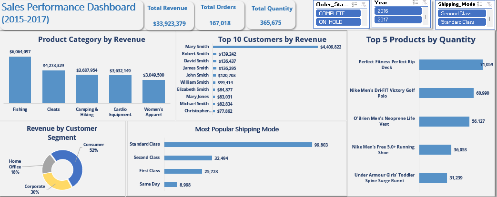

### Sales_Performance
---
### Table of Content
1. [Objective](#objective)
2. [Problem Statement](#problem_statement)
3. [Tool](#tool)
4. [Skills Demonstrated](#skills_demonstrated)
5. [Visualization](#visualization)
6. [Findings](#findings)
7. [Recommendations](#recommendations)
### Objective
The goal of this analysis is to assess sales performance from 2015 to 2017, focusing on revenue, product categories, customer segments, and shipping modes to identify trends, strengths, and areas for improvement.

---
### Problem Statement

Despite generating a significant total revenue of $34,255,029 over the analyzed period, the business needs to understand which factors drive performance, optimize customer engagement, and prioritize resources effectively to maintain growth and efficiency.

---
### Tool

I used Microsoft Excel to analyze and visualize the sales data, leveraging functionalities like pivot tables, charts, and dashboards for clear reporting.

---
### Skills Demonstrated

1. **Data Analysis:** Treated inconsistencies and missing values and also Using pivot tables to segment revenue, orders, and customer metrics.
2. **Visualization:** Creating bar graphs, pie charts, and dashboards for insights.
3. **Filtering & Slicing:** Using slicers to filter data by year, order status, and shipping modes.
4. **Business Intelligence:** Interpreting data to recommend actionable strategies.

---
### Visualization

This dashboard provides an overview of sales performance from 2015 to 2017, with key metrics such as total revenue, total orders, total quantity, customer segments, product performance, and shipping modes. 

---
### Findings

**1. Revenue Trends**

- **Total Revenue:** **$33,923,379** over the period (2015-2017).
- **Top Revenue-Generating Category:** Fishing products lead with **$6,064,097** in revenue.
- **Key Observation:** The revenue distribution across categories suggests that outdoor and sports-related products (Fishing, Cleats, and Camping & Hiking) contribute significantly.
- **Time-Based Analysis:** If revenue from certain product categories has grown or declined over the years, it could indicate shifting customer preferences or market trends.

**2. Order and Quantity Trends**
- **Total Orders:** **167,018** orders.
- **Total Quantity Sold:** **365,675** items.
- **Key Observation:** While revenue is high, the total quantity suggests a mix of high-value and lower-value items being sold.
- **Time-Based Analysis:** If the total quantity has grown while revenue remains stable, it could indicate a shift toward lower-priced products.

**3. Customer Segmentation and Contribution**
- **Consumer Segment Dominates**: **52%** of revenue comes from individual consumers.
- **Corporate Segment:** 30%, while Home Office: 18%.
- **Key Observation:** A higher consumer percentage suggests strong retail sales.
- **Time-Based Analysis:** If the corporate segment has grown, it may indicate stronger B2B relationships over time.
  
**4. Top Customers**
- **Highest Revenue from Mary Smith:** **$139,242**.
Top 10 customers contribute significantly, totaling around **$4.4 million**.
- **Key Observation:** A few high-value customers drive revenue.
- **Time-Based Analysis:** If the customer list remains consistent, retention is strong. If names change frequently, new customer acquisition is driving sales.

**5. Best-Selling Products (By Quantity)**
- **Top Product:** *Perfect Fitness Perfect Rip Deck* - **71,059** units sold.
- **Other strong sellers:** *Nike apparel and O’Brien life vests*.
- **Key Observation:** Fitness and sports-related products dominate quantity sales.
- **Time-Based Analysis:** If demand for these items has grown, fitness trends may be influencing purchasing behaviour.
  
**6. Shipping Mode Preferences**
- **Most Used Shipping Method:** **Standard Class** (99,803 orders).
- **Other Methods:** Second Class (32,494), First Class (25,723), and Same Day (8,998).
- **Key Observation:** Customers prefer cost-effective Standard Class shipping.
- **Time-Based Analysis:** If Same Day shipping increases over time, it may indicate changing customer expectations for faster delivery.

---
### Recommendations

**1. Increase Revenue Growth**
 **a. Expand High-Performing Categories**
- Fishing products generate the most revenue ($6M). Introduce bundles or premium versions.
- Cleats and Camping/Hiking are strong performers—offer promotions or expand product range.
  
**b. Target High-Value Customers**
- The top 10 customers contribute $4.4M. Implement a VIP loyalty program or exclusive discounts to retain them.
- Use personalized marketing (emails, targeted ads) to upsell/cross-sell products.
  
**c. Increase Corporate & Home Office Sales**
- Corporates contribute 30%, but they usually buy in bulk. Offer bulk discounts.
- Home Office (18%) can be grown by offering office bundles or workspace-related products.

**2. Boost Product Sales & Profitability**
**a. Expand High-Demand Products**
- *Perfect Fitness Perfect Rip Deck* is a bestseller. Feature it more prominently (ads, recommendations).
- Nike apparel is also popular—consider adding new styles or limited editions.
  
**b. Phase Out Slow Movers**
- Identify low-selling products and discontinue or bundle them with bestsellers.
  
 **c. Leverage Seasonal Trends**
- If camping & hiking products peak during summer, launch seasonal promotions & targeted ads.

**3. Optimize Shipping & Delivery**
**a. Encourage Faster Shipping Methods**
- Standard Class is dominant (99,803 orders), meaning customers prioritize cost over speed.
- Offer free or discounted First Class shipping for high-value orders to improve customer experience.
  
**b. Improve Same-Day Shipping**
- Only 8,998 orders use Same-Day. If faster delivery is a growing trend, negotiate better rates with couriers.
- Consider offering same-day delivery as a premium option in select regions.

